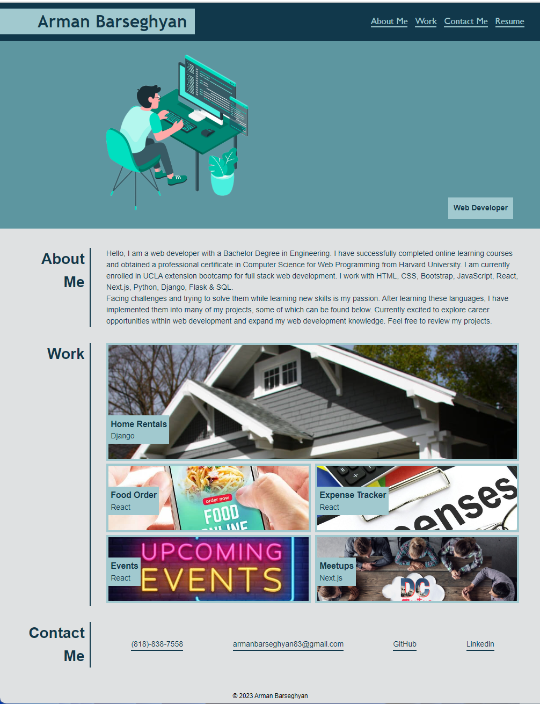

# Portfolio

## Description

This portfolio project taught me how to use flexbox, media queries and CSS variables. A portfolio website is a unique way to showcase your work and let others know about yourself.

## Usage

On the navigation bar there are buttons. Clicking on the buttons takes you to its corresponding section. On the work section clicking on the picture of the project will take to that project website. For contacting me you can click the links on the contact me section.

## Credits

Throughout this past year, I have completed different online courses and have previous programming experience by building my portfolio projects.

Please see my [Portfolio](https://armanbarseghyan83.github.io/portfolio/).
